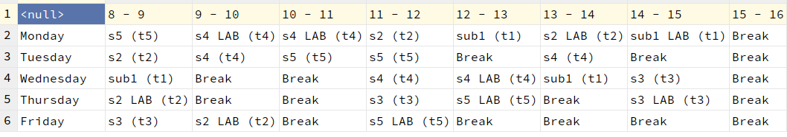

# Timetable

Timetable in C++

~~~
---------------------------
-------- Timetable --------
---------------------------

Enter the number of subjects: 5
Enter the subject 1 name: sub1
Enter the subject 'sub1' teacher name: t1

Enter the subject 2 name: s2
Enter the subject 's2' teacher name: t2

Enter the subject 3 name: s3
Enter the subject 's3' teacher name: t3

Enter the subject 4 name: s4
Enter the subject 's4' teacher name: t4

Enter the subject 5 name: s5
Enter the subject 's5' teacher name: t5
~~~

### Output

